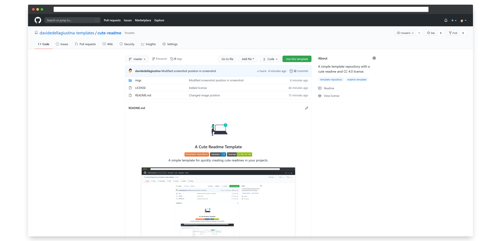

<!-- PROJECT LOGO -->

 

	
	<h3 align="center">A Cute Readme Template</h3>
	

		
		
		
		 
		A simple template for quickly creating cute readmes in your projects.
		 
		<!-- <a href="https://github.com/davidedellagiustina-templates/cute-readme/wiki"><strong>Explore the documentation</strong></a> -->
	

<!-- TABLE OF CONTENTS -->

## Table of contents <!-- omit in toc -->

- [About the project](#about-the-project)
- [Getting started](#getting-started)
- [License](#license)

<!-- ABOUT THE PROJECT -->

## About the project

This repository provides a simple and easy to use template including the following features:
- a cute and customizable readme;
- the `cc-by-nc-sa 4.0` license.

<!-- GETTING STARTED -->

## Getting started

In order to start using this template, just create a new repository and select this one as a template!

<!-- ### Prerequisites -->

<!-- ### Installation -->

<!-- ## Usage -->

## License

This software is licensed under the [Creative Commons Attribution-NonCommercial-ShareAlike 4.0 License](https://creativecommons.org/licenses/by-nc-sa/3.0/it/deed.en). This means that you are allowed to remix, transform, adapt, and build upon the software included in this repository, you can copy and redistribute it in any medium or format, under the following terms:

1. **Attribution** &ndash; you must give appropriate credit, provide a link to the license, and indicate if changes were made. You may do so in any reasonable manner, but not in any way that suggests the licensor endorses you or your use.

2. **NonCommercial** &ndash; you may not use the software included in this repository for commercial purposes.

3. **ShareAlike** &ndash; if you remix, transform, or build upon the software included in this repository, you must distribute your contributions under the same license as the original.

See `LICENSE` for more information.

