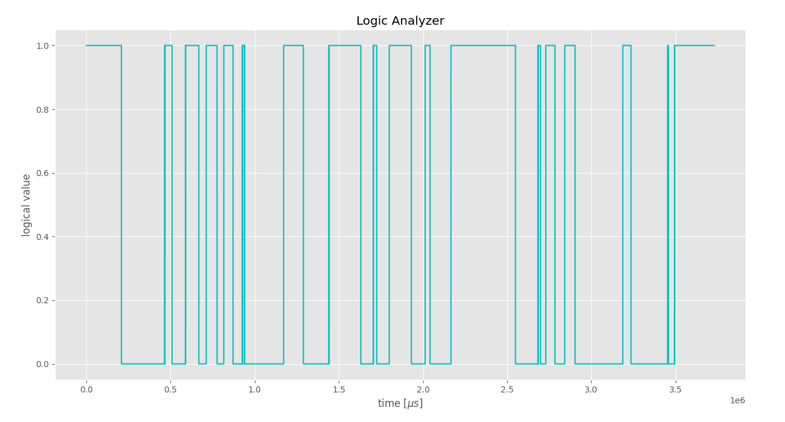

<!-- PROJECT LOGO -->

 

	
	<h3 align="center">ESP32 Logic Analyzer</h3>
	

		
		
		 
		A very basic esp32-based logic analyzer capable of sampling digital signals at up to ~3.2MHz.
		 
	

	

<!-- TABLE OF CONTENTS -->

## Table of contents <!-- omit in toc -->

- [About the project](#about-the-project)
- [License](#license)

<!-- ABOUT THE PROJECT -->

## About the project

For a university project I needed a basic logic analyzer for sampling a signal coming from an IR receiver (~38kHz carrier frequency). Therefore, I decided to build my own by using an esp32, and it turned out to be quite good!

## License

This software is licensed under the [Creative Commons Attribution-NonCommercial-ShareAlike 4.0 License](https://creativecommons.org/licenses/by-nc-sa/4.0/). This means that you are allowed to remix, transform, adapt, and build upon the software included in this repository, you can copy and redistribute it in any medium or format, under the following terms:

1. **Attribution** &ndash; you must give appropriate credit, provide a link to the license, and indicate if changes were made. You may do so in any reasonable manner, but not in any way that suggests the licensor endorses you or your use.

2. **NonCommercial** &ndash; you may not use the software included in this repository for commercial purposes.

3. **ShareAlike** &ndash; if you remix, transform, or build upon the software included in this repository, you must distribute your contributions under the same license as the original.

See `LICENSE` for more information.

